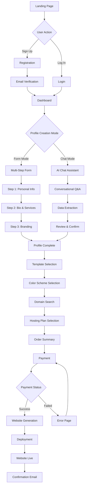

# Eye-Dentity User Onboarding Flow

Visual guide to the complete user journey from registration to website launch.

## User Journey Map



## Detailed Flow Steps

### 1. Landing Page

**User sees:**
- Hero section with value proposition
- "Get Started" CTA button
- Template previews
- Pricing information
- Login link

**User actions:**
- Click "Get Started" → Registration
- Click "Log In" → Login page
- Browse templates
- View pricing

---

### 2. Registration

**Form fields:**
- Email address (required)
- Password (required, min 8 characters)
- Full name (required)
- Agree to terms (checkbox)

**Validation:**
- Email format check
- Password strength indicator
- Duplicate email check

**Success:**
- Account created
- JWT token generated
- Redirect to dashboard

**Errors:**
- Email already exists
- Weak password
- Invalid email format

---

### 3. Dashboard (First Time)

**User sees:**
- Welcome message
- "Create Your Profile" card
- Progress indicator (0%)
- Mode selector (Form vs Chat)

**User actions:**
- Select Form Mode → Multi-step form
- Select Chat Mode → AI assistant

---

### 4A. Form Mode - Profile Creation

#### Step 1: Personal Information

**Fields:**
- Full name (pre-filled from registration)
- Profession (dropdown with search)
- Email (pre-filled)
- Phone number (optional)
- Location (optional)

**Validation:**
- All required fields filled
- Valid phone format
- Profession selected

**Actions:**
- Next → Step 2
- Save Draft (auto-save every 30 seconds)

#### Step 2: Bio & Services

**Fields:**
- Bio (textarea, 100-500 characters)
- Services (dynamic list)
  - Add service button
  - Remove service button
  - Drag to reorder

**AI Assistance:**
- "Help me write my bio" button
- Bio suggestions based on profession

**Actions:**
- Back → Step 1
- Next → Step 3
- Save Draft

#### Step 3: Branding

**Fields:**
- Logo upload (drag & drop or browse)
- Profile photo upload (optional)
- Preview of uploaded images

**File requirements:**
- Logo: PNG/JPG, max 5MB, recommended 500x500px
- Photo: PNG/JPG, max 5MB, recommended 800x800px

**Actions:**
- Back → Step 2
- Complete Profile → Template Selection
- Save Draft

---

### 4B. Chat Mode - Profile Creation

#### Chat Interface

**Initial message:**
```
Hi! I'm your AI assistant. I'll help you create your professional profile 
through a friendly conversation. Let's start - what's your profession?
```

**Conversation flow:**
1. Ask about profession
2. Ask about services/specializations
3. Ask about background/experience
4. Ask about contact preferences
5. Confirm collected information

**Features:**
- Real-time typing indicators
- Message history
- Edit previous responses
- Progress indicator
- "Switch to Form Mode" option

**Data extraction:**
- AI parses responses
- Extracts structured data
- Shows collected data in sidebar
- User can edit extracted data

**Completion:**
- Review screen with all collected data
- Edit any field
- Confirm → Template Selection

---

### 5. Template Selection

**User sees:**
- Template gallery (grid layout)
- Filter by category
- Search templates
- Template preview cards

**Template card shows:**
- Template name
- Category badge
- Preview image
- "Preview" button
- "Select" button

**Preview modal:**
- Full-size template preview
- Color scheme selector
- "Use This Template" button
- Close button

**Actions:**
- Click template → Preview modal
- Select color scheme → Preview updates
- "Use This Template" → Domain Search

---

### 6. Color Scheme Selection

**User sees:**
- Selected template preview
- Color scheme options (6 variations)
- Live preview of color changes

**Color schemes:**
- Default (Blue)
- Navy
- Emerald
- Purple
- Slate
- Crimson

**Actions:**
- Click color scheme → Preview updates
- Next → Domain Search

---

### 7. Domain Search

**User sees:**
- Domain search input
- Real-time availability check
- Alternative suggestions
- Pricing for different TLDs

**Search flow:**
1. User types domain name
2. Real-time availability check
3. Show available/taken status
4. Display alternative suggestions

**Domain card shows:**
- Domain name
- Availability status
- Price per year
- "Select" button

**Actions:**
- Select domain → Hosting Plan Selection
- Try different domain → Search again

---

### 8. Hosting Plan Selection

**User sees:**
- Three plan cards (Basic, Pro, Premium)
- Feature comparison
- Pricing (monthly/yearly toggle)
- Recommended badge on Pro plan

**Plan cards show:**
- Plan name
- Price
- Key features (bulleted list)
- "Select Plan" button

**Email hosting toggle:**
- Available for Pro & Premium
- Shows additional cost
- Explains what's included

**Actions:**
- Select plan → Order Summary
- Toggle billing cycle → Prices update
- Toggle email hosting → Price updates

---

### 9. Order Summary

**User sees:**
- Selected template (with preview)
- Domain name
- Hosting plan
- Email hosting (if selected)
- Price breakdown
- Total amount
- Edit buttons for each section

**Price breakdown:**
- Domain registration: $XX.XX/year
- Hosting plan: $XX.XX/month
- Email hosting: $XX.XX/month (if selected)
- Subtotal
- Tax (if applicable)
- **Total**

**Actions:**
- Edit template → Back to Template Selection
- Edit domain → Back to Domain Search
- Edit plan → Back to Hosting Plans
- Proceed to Payment → Payment page

---

### 10. Payment

**User sees:**
- Order summary (condensed)
- Stripe checkout form
- Accepted payment methods
- Security badges
- Terms and conditions

**Payment form:**
- Card number
- Expiry date
- CVC
- Billing address
- Save card for future (checkbox)

**Actions:**
- Complete Payment → Processing
- Back → Order Summary

---

### 11. Payment Processing

**User sees:**
- Loading spinner
- "Processing your payment..." message
- Progress indicator

**Backend process:**
1. Create Stripe checkout session
2. Process payment
3. Create order record
4. Trigger website generation
5. Send confirmation email

**Outcomes:**
- Success → Website Generation page
- Failed → Error page with retry option

---

### 12. Website Generation

**User sees:**
- Success message
- Generation progress
- Estimated time (15-20 minutes)
- What's happening (step-by-step)

**Progress steps:**
1. ✓ Payment confirmed
2. ⏳ Generating website content
3. ⏳ Building your website
4. ⏳ Deploying to server
5. ⏳ Configuring domain
6. ⏳ Setting up SSL

**Actions:**
- View Dashboard
- Check email for updates

---

### 13. Website Live

**User sees:**
- Celebration animation
- "Your Website is Live!" message
- Website URL
- Preview button
- Share buttons

**Email notification:**
- Subject: "Your Website is Live!"
- Website URL
- Login credentials (if applicable)
- Next steps
- Support information

**Actions:**
- Visit Website → Opens in new tab
- Share on social media
- Go to Dashboard

---

## Decision Points

### Profile Creation Mode

**Decision:** Form vs Chat

**Factors:**
- User preference
- Time available
- Comfort with AI
- Detail level needed

**Recommendation:**
- Chat: Faster, more natural
- Form: More control, structured

### Template Selection

**Decision:** Which template to choose

**Factors:**
- Profession
- Personal style
- Target audience
- Industry standards

**Recommendation:**
- Professional: Lawyers, consultants, doctors
- Creative: Designers, photographers
- Healthcare: Medical professionals

### Hosting Plan

**Decision:** Basic, Pro, or Premium

**Factors:**
- Budget
- Feature needs
- Email hosting requirement
- Marketing needs

**Recommendation:**
- Basic: Individual professionals, simple needs
- Pro: Small businesses, need email
- Premium: Growing businesses, want marketing

---

## Error Handling

### Common Errors

#### Registration Errors

**Email already exists:**
- Show error message
- Suggest login instead
- Offer password reset

**Weak password:**
- Show password requirements
- Display strength indicator
- Suggest strong password

#### Payment Errors

**Card declined:**
- Show error message
- Suggest trying different card
- Offer alternative payment methods

**Insufficient funds:**
- Show error message
- Suggest contacting bank
- Save order for later

#### Generation Errors

**Website generation failed:**
- Show error message
- Explain what happened
- Offer to retry
- Contact support option

---

## Success Criteria

### Profile Creation

- ✓ All required fields completed
- ✓ Valid email and phone format
- ✓ At least one service listed
- ✓ Bio between 100-500 characters

### Template Selection

- ✓ Template selected
- ✓ Color scheme chosen
- ✓ Preview reviewed

### Domain Selection

- ✓ Domain available
- ✓ Domain selected
- ✓ Price confirmed

### Payment

- ✓ Payment successful
- ✓ Order created
- ✓ Confirmation email sent

### Website Launch

- ✓ Website generated
- ✓ Website deployed
- ✓ Domain configured
- ✓ SSL certificate active
- ✓ User notified

---

## Metrics to Track

### Conversion Funnel

1. Landing page visits
2. Registrations started
3. Registrations completed
4. Profiles created
5. Templates selected
6. Domains selected
7. Plans selected
8. Payments initiated
9. Payments completed
10. Websites launched

### Drop-off Points

- Registration form abandonment
- Profile creation abandonment
- Template selection abandonment
- Payment abandonment

### Time Metrics

- Time to complete registration
- Time to create profile
- Time to select template
- Time to complete payment
- Time to website launch

---

**Last Updated:** December 2024  
**Version:** 1.0.0
